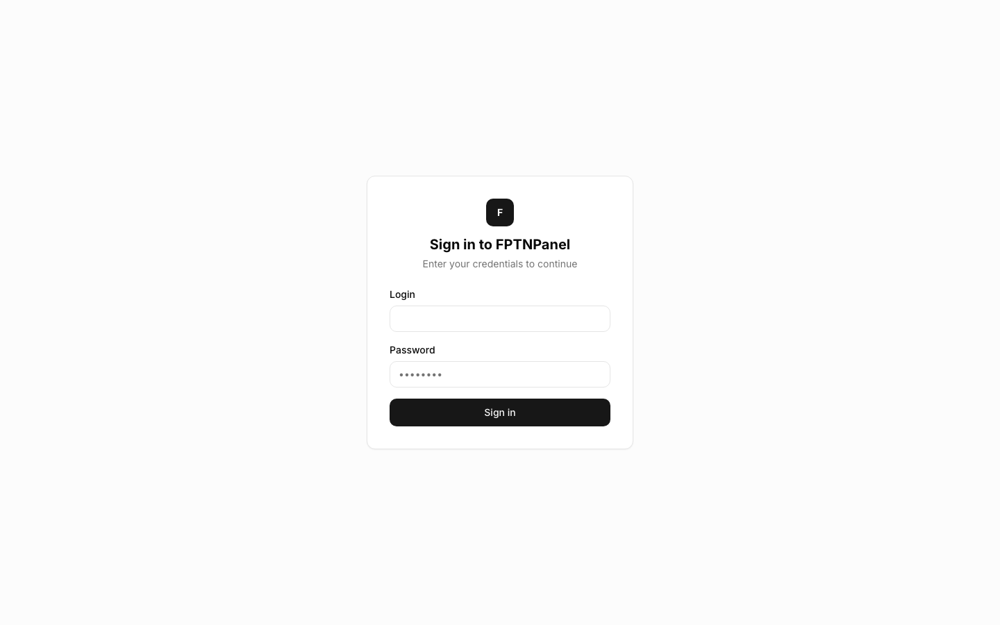
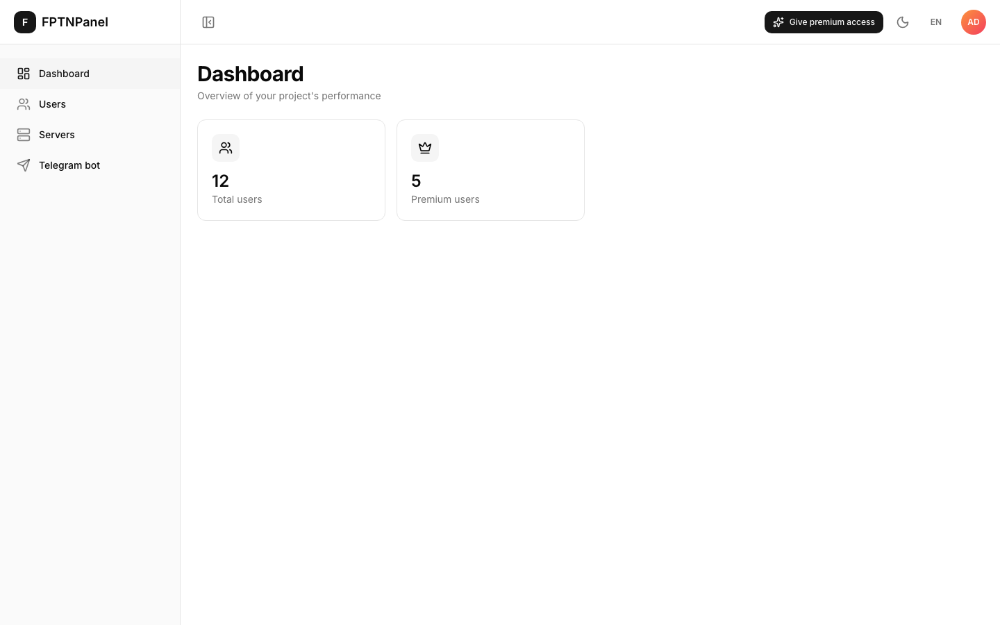
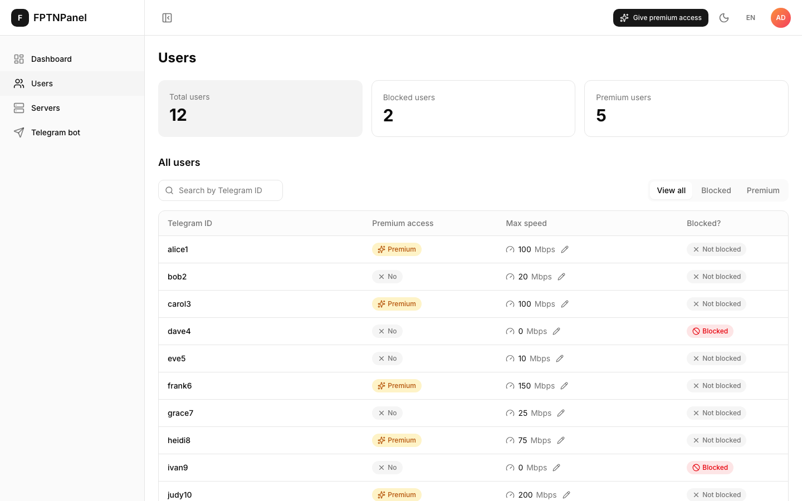
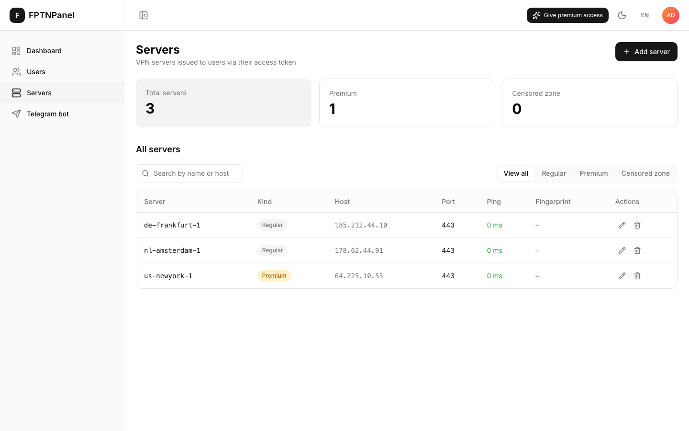
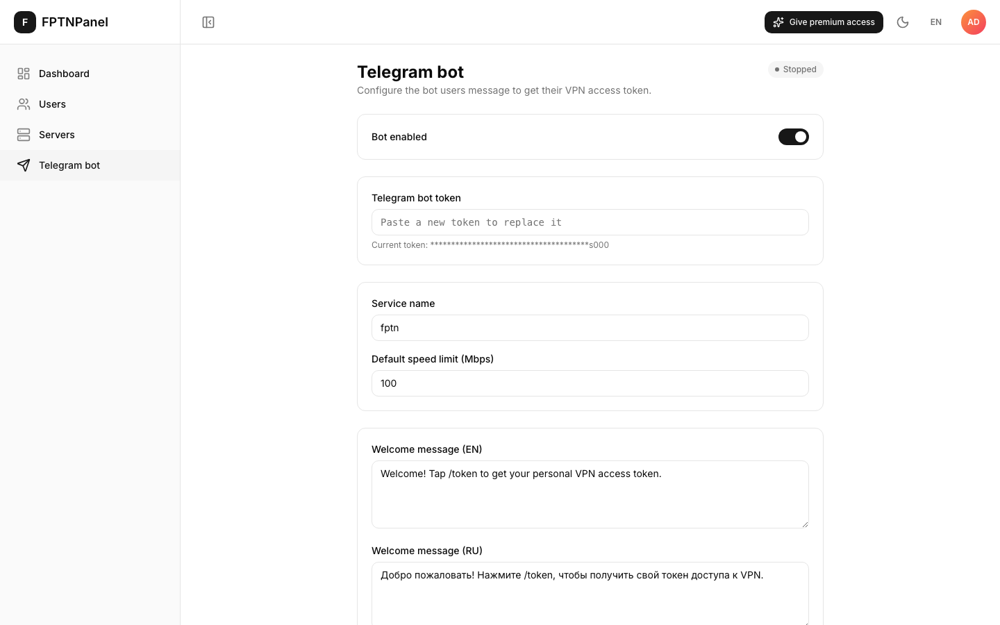

<div align="center">

<h1>FPTN Admin Panel</h1>
<h6>A simple web dashboard for your FPTN VPN server</h6>

[\[English\]](README.md)
•
[\[Русский\]](README_RU.md)

[](https://github.com/fptn-project/fptn-admin/actions)

</div>

---

## What is this?

If you run your own [FPTN](https://github.com/batchar2/fptn) VPN server, at some
point you need a way to see who's using it, add or remove VPN servers, and run
the Telegram bot that gives people their access token — without editing config
files by hand over SSH.

**FPTN Admin Panel** is a website you open in your browser that does all of
that for you. No command line, no code — just click buttons.

With it you can:

- 👥 See every VPN user, search/filter them, block or unblock, give premium access
- 🖥️ Add, edit, and remove the VPN servers your users connect to
- 🤖 Turn your Telegram bot on or off, and edit the message it sends new users
- 📊 See at a glance how many people use your service
- 🌍 Switch between English and Russian with one click
- 🌗 Light and dark mode

## Screenshots

**Sign in**


<br/>

**Dashboard** — a quick look at how many users you have


<br/>

**Users** — search, filter, block/unblock, or give premium access, right from the table


<br/>

**Servers** — the VPN servers handed out to your users


<br/>

**Telegram bot** — turn it on/off and write the welcome message, in English and Russian



---

## How to install it

You only need one thing on your computer or server:
**[Docker](https://www.docker.com/)** (it comes with Docker Compose built in).

1. **Download this project**

   ```bash
   git clone https://github.com/fptn-project/fptn-admin.git
   cd fptn-admin
   ```

2. **Create your settings file**

   ```bash
   cp .env.demo .env
   ```

   You don't have to change anything in it — the defaults just work for
   trying it out.

3. **Start everything**

   ```bash
   docker compose up --build
   ```

   This builds and starts two things: the panel itself, and the small server
   that powers it. The first run takes a few minutes; after that it's much
   faster.

4. **Open the panel in your browser**

   Go to **https://localhost:2663**

   Your browser will warn that the connection "is not private" — that's
   expected. The panel creates its own certificate the first time it starts,
   and browsers don't trust self-signed certificates by default. Click
   "Advanced" → "Proceed anyway" (the exact wording depends on your browser).

5. **Log in**

   - Login: `admin`
   - Password: `admin`

   You'll be asked to set a new password immediately — that's intentional,
   so nobody is left running with the default one.

That's it — you're in.

### Stopping it

```bash
docker compose down
```

Nothing gets deleted: your users, servers, and settings stay saved on disk.
Start it again any time with `docker compose up`.

---

<details>
<summary><strong>For developers</strong></summary>

### Project layout

```
fptn-admin/
  backend/     FastAPI service (Poetry) — REST API + the Telegram bot
  frontend/    admin panel SPA (React + TypeScript + Vite)
  docker-compose.yml
```

See [backend](backend) and [frontend](frontend) for stack details, local
dev without Docker, scripts, and tests.

### How VPN users are stored

There is **one** source of truth: the fptn `users.list` file, shared with the
fptn C++ server and this project's own Telegram bot. One line per user:

```
<telegramId> <sha256_hex_password> <speed_MB> <is_premium(0|1)>
```

- passwords are SHA-256 hex (so the C++ server accepts them);
- `maxSpeed` maps to the speed column (MB);
- `premiumAccess` maps to `is_premium`;
- **`blocked` is derived, not stored:** a user is blocked when `speed == 0`.
  Blocking sets speed to 0 (the fptn server then throttles the tunnel to a
  standstill). Unblocking restores speed from the request's `maxSpeed`, or
  the `maxUserSpeedLimit` setting if none is given.

Panel admins (JWT login) are unrelated to VPN users and live in a separate
`admins.json` (bcrypt-hashed passwords). On an empty store the first admin is
seeded from `ADMIN_LOGIN` / `ADMIN_PASSWORD` (default `admin` / `admin`,
Grafana-style). While the default password is in use, `login` returns
`mustChangePassword: true` — the frontend forces the change-password form
before letting the admin in.

### API

Every route except `/api/v1/auth/login` requires `Authorization: Bearer <token>`.

| Method | Path | Purpose |
|--------|------|---------|
| POST | `/api/v1/auth/login` | admin login → JWT (+ `mustChangePassword`) |
| POST | `/api/v1/auth/change-password` | change own password (needs current password) |
| POST | `/api/v1/auth/register` | create a panel (service) user |
| GET  | `/api/v1/users?page=&pageSize=&search=&filter=` | list (filter: all\|blocked\|premium) |
| GET  | `/api/v1/users/{username}` | one user (404 `{"message":"User not found"}`) |
| PUT  | `/api/v1/users/{username}` | partial update (username, maxSpeed, blocked, premiumAccess) |
| POST | `/api/v1/users` | create a VPN user → returns the `token` |
| POST | `/api/v1/users/{username}/token` | (re)issue token — resets the password to a new random one |
| GET  | `/api/v1/servers` | list servers (`regular` / `premium` / `censoredZone`) |
| POST | `/api/v1/servers` | add a server (`kind`: regular\|premium\|censored) |
| PUT  | `/api/v1/servers/{kind}/{name}` | update a server (host, fingerprint, port, ping, or rename) |
| DELETE | `/api/v1/servers/{kind}/{name}` | remove a server |
| GET  | `/api/v1/dashboard/highlights` | `{ totalUsers, premiumUsers, blockedUsers }` |
| GET  | `/api/v1/settings` | bot/service settings (telegram token is masked) |
| PUT  | `/api/v1/settings` | update settings; changing `telegramToken`/`botEnabled` restarts the bot |

Interactive docs (Swagger UI) at `http://localhost:8000/docs`.

### VPN access token

`token` is the string you paste into the fptn client. It's built exactly like
the telegram-bot: a JSON `{version, service_name, username, password, servers,
censored_zone_servers}` base64-encoded behind a `fptn:` prefix (`fptnb:` +
brotli when `ENABLE_BROTLI_COMPRESSION=true`). `servers` = premium + regular
for premium users, regular only otherwise — read from the shared
`servers.json` / `premium_servers.json` / `servers_censored_zone.json`.

The token embeds the **plaintext** password (only its hash is stored), so it
can only be produced when the password is known: on create (returned in the
response) or via `.../token`, which generates a fresh password and updates
the stored hash — same behaviour as the bot's `/token`.

### Telegram bot

`app/telegram_bot.py` runs the bot in-process, as a background thread — no
separate bot container. `/api/v1/settings` (`telegramToken`, `botEnabled`)
starts/stops it; `/start` and `/token` call the same `vpn_store`/`server_store`
the REST API uses, so the bot and the panel write `users.list` through the
same file lock.

All of `telegramToken`, `botEnabled`, `maxUserSpeedLimit`, `serviceName` and
the welcome messages live in `bot_settings.json` (inside
`FPTN_CONFIGS_FOLDER`) and are edited through the Settings page. The matching
env vars (`TELEGRAM_TOKEN`, `BOT_ENABLED`, ...) are only a first-run seed —
same as `ADMIN_LOGIN`/`ADMIN_PASSWORD` — used once when that file doesn't
exist yet; once it does, the file is authoritative and the env vars are
ignored.

### HTTPS

The SPA is served over HTTPS with a self-signed certificate, generated on
first start and persisted as `certs/fullchain.pem` / `certs/privkey.pem`
inside `FPTN_CONFIGS_FOLDER` — that's why browsers warn about it. Bring your
own certificate (reverse proxy, Let's Encrypt, ...) in front of it for a real
deployment. Plain `http://localhost:8080` just redirects to the HTTPS port,
since browsers default to `http://` when you type a bare `host:port`. nginx
also proxies `/api/` to the backend, so the SPA only ever talks to its own
origin.

### Run just the backend

```bash
docker compose up --build fptn-admin-backend
```

### Local dev (without Docker)

```bash
cd backend
poetry install
poetry run uvicorn app.main:app --reload
```

See [frontend/README.md](frontend/README.md) for running the SPA locally.

### CI

`.github/workflows/ci.yml` lints, type-checks, tests, and builds both the
frontend (npm) and backend (poetry) on every push/PR. See the
[Actions tab](https://github.com/fptn-project/fptn-admin/actions).

</details>
