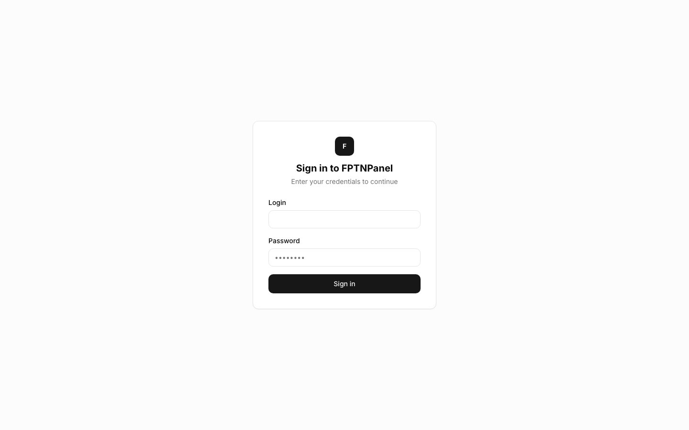
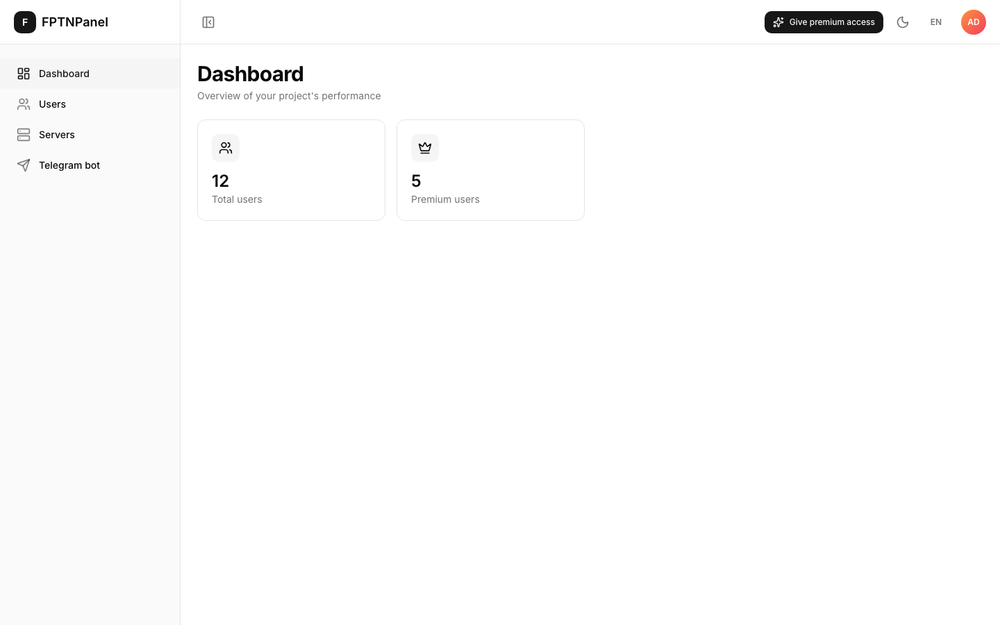
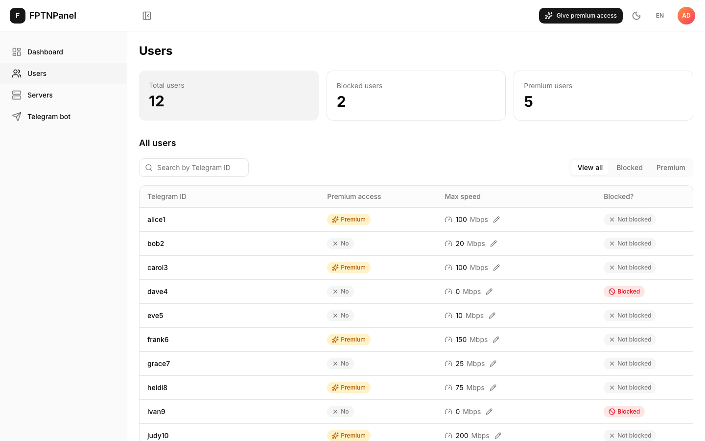
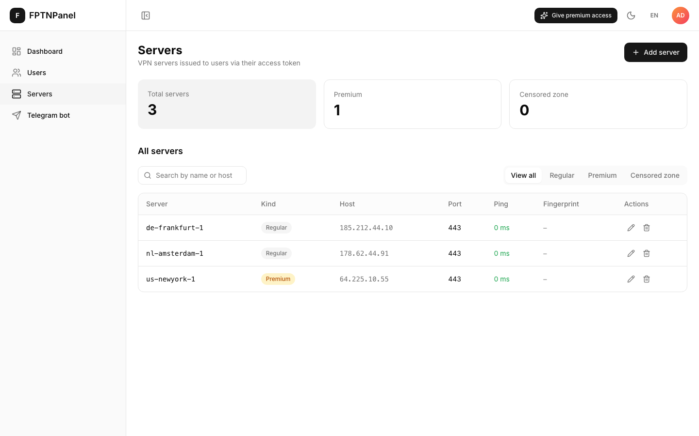
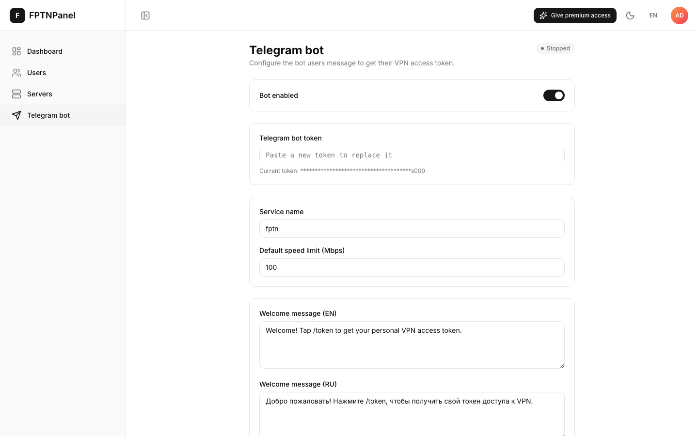

<div align="center">

<h1>FPTN Admin Panel</h1>
<h6>A simple web dashboard for your FPTN VPN server</h6>

[\[English\]](README.md)
•
[\[Русский\]](README_RU.md)

[](https://github.com/fptn-project/fptn-admin/actions)

</div>

---

## What is this?

**FPTN Admin Panel** is a web dashboard for running an
[FPTN](https://github.com/batchar2/fptn) VPN server from your browser — manage
users, servers and the Telegram bot without editing config files over SSH.

With it you can:

- 👥 **Users** — add users and issue or reissue their access tokens, search
  and filter, block or unblock, grant premium access
- 🖥️ **Servers** — add, edit and remove the VPN servers your clients connect to
- 🤖 **Telegram bot** — enable or disable it and edit its welcome message
- 📊 **Dashboard** — total, premium and blocked users at a glance
- 🌍 **English & Russian**, with light and dark themes

## Screenshots

**Sign in**


<br/>

**Dashboard** — a quick look at how many users you have


<br/>

**Users** — add a user, issue or reissue a token, search, filter, block/unblock, or give premium access, right from the table


<br/>

**Servers** — the VPN servers handed out to your users


<br/>

**Telegram bot** — turn it on/off and write the welcome message, in English and Russian



---

## How to install it

The included `docker-compose.yml` runs the whole stack — the FPTN VPN server,
this admin panel (backend + frontend), and the Telegram bot — from prebuilt
images on Docker Hub. You need a **Linux** host with
**[Docker](https://docs.docker.com/engine/install/)** and port **443/tcp** open.

1. **Get the files**

   ```bash
   git clone https://github.com/fptn-project/fptn-admin.git && cd fptn-admin
   ```

2. **Create your `.env`**

   ```bash
   cp .env.demo .env
   ```

   The defaults work out of the box; every option is documented in `.env.demo`.

3. **Create the VPN server certificate**

   ```bash
   docker compose run --rm fptn-server sh -c "cd /etc/fptn && openssl genrsa -out server.key 2048"
   docker compose run --rm fptn-server sh -c "cd /etc/fptn && openssl req -new -x509 -key server.key -out server.crt -days 365 -subj '/CN=fptn'"
   ```

   Print its fingerprint — you'll enter it in the panel in step 6:

   ```bash
   docker compose run --rm fptn-server sh -c "openssl x509 -noout -fingerprint -md5 -in /etc/fptn/server.crt | cut -d'=' -f2 | tr -d ':' | tr 'A-F' 'a-f' | xargs -I {} echo 'MD5 Fingerprint: {}'"
   ```

4. **Start**

   ```bash
   docker compose up -d
   ```

   Check it's up with `docker compose ps`.

5. **Open the panel and log in**

   Go to **https://&lt;server-ip&gt;:2663**, accept the self-signed certificate
   warning, and log in with `admin` / `admin`. Set a new password when asked.

6. **Add this server, then your users**

   In the panel: **Servers → Add server** (host, port `443`, and the fingerprint
   from step 3), then **Users → Add user** — the connection token (`fptn:…`) is
   shown on creation; paste it into the FPTN client.

   A user lost their token, or you want to rotate it? Click **Issue token**
   next to them in the Users table — a fresh token is generated on the spot
   and the old one stops working immediately.

7. **Enable the Telegram bot** *(optional)*

   In the panel: **Settings** — paste your bot token and turn the bot on. It
   runs inside the backend, so no extra container or restart is needed.

## Configuration

All settings live in `.env` (copied from `.env.demo`, where every option is
documented inline). The defaults work out of the box.

**FPTN VPN server**

| Variable | Default | What it does |
|---|---|---|
| `SERVER_EXTERNAL_IPS` | — | Public IPv4/IPv6 of the server, comma-separated (optional). |
| `FPTN_PORT` | `443` | Public TCP port clients connect to (looks like HTTPS). |
| `ENABLE_DETECT_PROBING` | `true` | Detect non-FPTN clients / probing at the TLS handshake. |
| `ALLOWED_SNI_LIST` | see `.env.demo` | Decoy domains scanner traffic is proxied to. |
| `ENABLE_ADS_FILTER`, `ADS_BLOCKLIST_URLS` | `true` | Block ad/tracker domains by SNI. |
| `ENABLE_DOMAIN_BLACKLIST_FILTER`, `DOMAIN_BLACKLIST_URLS` | `true` | Block blacklisted domains by SNI + resolved IPs. |
| `ENABLE_TORRENT_FILTER` | `true` | Block BitTorrent traffic. |
| `ENABLE_SPAM_FILTER` | `true` | Block mail/telnet/SMB/amplification ports. |
| `MAX_ACTIVE_SESSIONS_PER_USER` | `3` | Max simultaneous sessions per VPN user. |
| `MTU_SIZE` | `1400` | Max IP packet size. |
| `USING_DNS_SERVER`, `DNS_*` | `unbound` | DNS resolver handed to clients. |
| `USE_REMOTE_SERVER_AUTH`, `REMOTE_SERVER_AUTH_*` | `false` | Cluster mode: delegate auth to a master server. |
| `PROMETHEUS_SECRET_ACCESS_KEY` | — | Key for Prometheus to read server metrics. |

**Admin panel**

| Variable | Default | What it does |
|---|---|---|
| `PANEL_PORT` | `2663` | Host port for the web UI (HTTPS). |

Other panel settings (admin `admin`/`admin`, JWT TTL, CORS, brotli) are
hardcoded in `docker-compose.yml`; the shared config folder is `./compose-data`.
The Telegram bot (token, on/off, service name, speed limit, welcome messages)
is configured on the panel's **Settings** page, not via `.env`.

## Updating and stopping

```bash
docker compose down                           # stop (data in ./compose-data is kept)
docker compose pull && docker compose up -d   # update to the latest images
```

## Development (build from source)

`docker-compose.dev.yml` runs the same stack but builds the panel
(backend + frontend) from source instead of pulling the images:

```bash
cp .env.demo .env
docker compose -f docker-compose.dev.yml up --build
```

Open **https://localhost:2663** and log in with `admin` / `admin`. To run only
the panel (no VPN server), name the services:
`docker compose -f docker-compose.dev.yml up --build fptn-admin-backend fptn-admin-frontend`.

---

<details>
<summary><strong>For developers</strong></summary>

### Project layout

```
fptn-admin/
  backend/                FastAPI service (Poetry) — REST API + the Telegram bot
  frontend/               admin panel SPA (React + TypeScript + Vite)
  docker-compose.yml      full stack from prebuilt images
  docker-compose.dev.yml  same stack, panel built from source
```

See [backend](backend) and [frontend](frontend) for stack details, local
dev without Docker, scripts, and tests.

### How VPN users are stored

There is **one** source of truth: the fptn `users.list` file, shared with the
fptn C++ server and this project's own Telegram bot. One line per user:

```
<telegramId> <sha256_hex_password> <speed_MB> <is_premium(0|1)>
```

- passwords are SHA-256 hex (so the C++ server accepts them);
- `maxSpeed` maps to the speed column (MB);
- `premiumAccess` maps to `is_premium`;
- **`blocked` is derived, not stored:** a user is blocked when `speed == 0`.
  Blocking sets speed to 0 (the fptn server then throttles the tunnel to a
  standstill). Unblocking restores speed from the request's `maxSpeed`, or
  the `maxUserSpeedLimit` setting if none is given.

Panel admins (JWT login) are unrelated to VPN users and live in a separate
`admins.json` (bcrypt-hashed passwords). On an empty store the first admin is
seeded from `ADMIN_LOGIN` / `ADMIN_PASSWORD` (default `admin` / `admin`,
Grafana-style). While the default password is in use, `login` returns
`mustChangePassword: true` — the frontend forces the change-password form
before letting the admin in.

### API

Every route except `/api/v1/auth/login` requires `Authorization: Bearer <token>`.

| Method | Path | Purpose |
|--------|------|---------|
| POST | `/api/v1/auth/login` | admin login → JWT (+ `mustChangePassword`) |
| POST | `/api/v1/auth/change-password` | change own password (needs current password) |
| POST | `/api/v1/auth/register` | create a panel (service) user |
| GET  | `/api/v1/users?page=&pageSize=&search=&filter=` | list (filter: all\|blocked\|premium) |
| GET  | `/api/v1/users/{username}` | one user (404 `{"message":"User not found"}`) |
| PUT  | `/api/v1/users/{username}` | partial update (username, maxSpeed, blocked, premiumAccess) |
| POST | `/api/v1/users` | create a VPN user → returns the `token` |
| POST | `/api/v1/users/{username}/token` | (re)issue token — resets the password to a new random one |
| GET  | `/api/v1/servers` | list servers (`regular` / `premium` / `censoredZone`) |
| POST | `/api/v1/servers` | add a server (`kind`: regular\|premium\|censored) |
| PUT  | `/api/v1/servers/{kind}/{name}` | update a server (host, fingerprint, port, ping, or rename) |
| DELETE | `/api/v1/servers/{kind}/{name}` | remove a server |
| GET  | `/api/v1/dashboard/highlights` | `{ totalUsers, premiumUsers, blockedUsers }` |
| GET  | `/api/v1/settings` | bot/service settings (telegram token is masked) |
| PUT  | `/api/v1/settings` | update settings; changing `telegramToken`/`botEnabled` restarts the bot |

Interactive docs (Swagger UI) at `http://localhost:8000/docs`.

### VPN access token

`token` is the string you paste into the fptn client. It's built exactly like
the telegram-bot: a JSON `{version, service_name, username, password, servers,
censored_zone_servers}` base64-encoded behind a `fptn:` prefix (`fptnb:` +
brotli when `ENABLE_BROTLI_COMPRESSION=true`). `servers` = premium + regular
for premium users, regular only otherwise — read from the shared
`servers.json` / `premium_servers.json` / `servers_censored_zone.json`.

The token embeds the **plaintext** password (only its hash is stored), so it
can only be produced when the password is known: on create (returned in the
response) or via `.../token`, which generates a fresh password and updates
the stored hash — same behaviour as the bot's `/token`.

### Telegram bot

The bot runs inside the backend — no separate container. To enable it:

1. Create a bot with [@BotFather](https://t.me/BotFather) and copy the token.
2. In the panel open **Settings**, paste the token, turn the bot on, and save —
   it starts right away, no restart needed.
3. The same page sets the service name, default speed limit and the welcome
   messages (EN/RU).

Users then message the bot with `/start` and `/token` — it creates them in the
same `users.list` as the panel and replies with their connection token.

### HTTPS

The SPA is served over HTTPS with a self-signed certificate, generated on
first start and persisted as `certs/fullchain.pem` / `certs/privkey.pem`
inside the `/etc/fptn` config directory — that's why browsers warn about it.
Bring your own certificate (reverse proxy, Let's Encrypt, ...) in front of it
for a real deployment. nginx also proxies `/api/` to the backend, so the SPA
only ever talks to its own origin.

### Run just the backend

```bash
docker compose -f docker-compose.dev.yml up --build fptn-admin-backend
```

### Local dev (without Docker)

```bash
cd backend
poetry install
poetry run uvicorn app.main:app --reload
```

See [frontend/README.md](frontend/README.md) for running the SPA locally.

### CI

`.github/workflows/ci.yml` lints, type-checks, tests, and builds both the
frontend (npm) and backend (poetry) on every push/PR. See the
[Actions tab](https://github.com/fptn-project/fptn-admin/actions).

</details>
