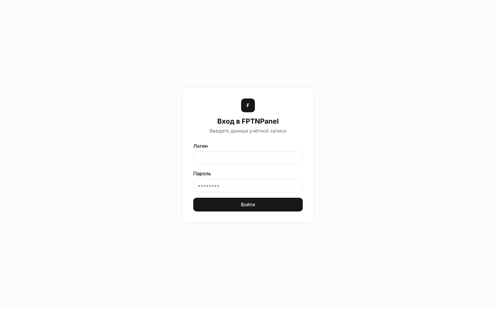
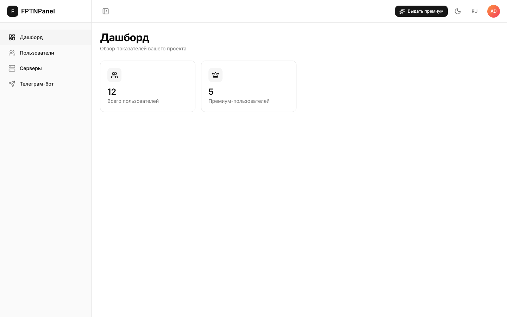
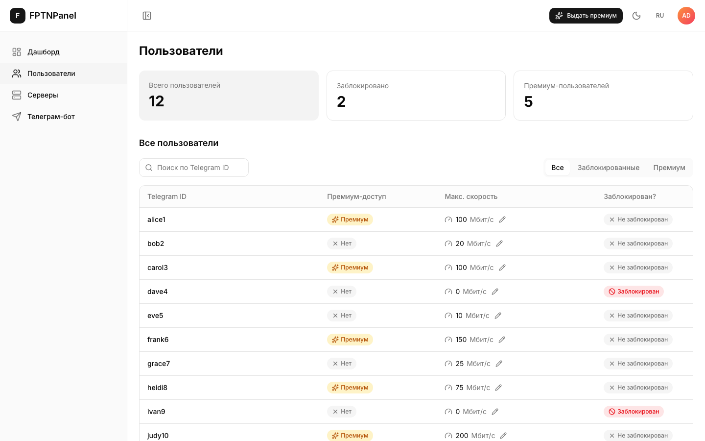
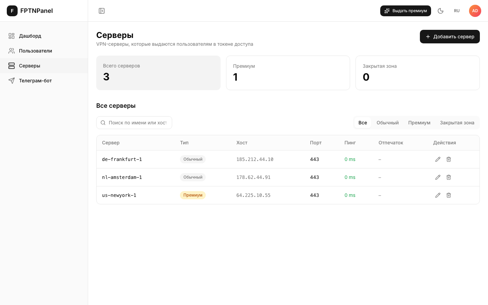
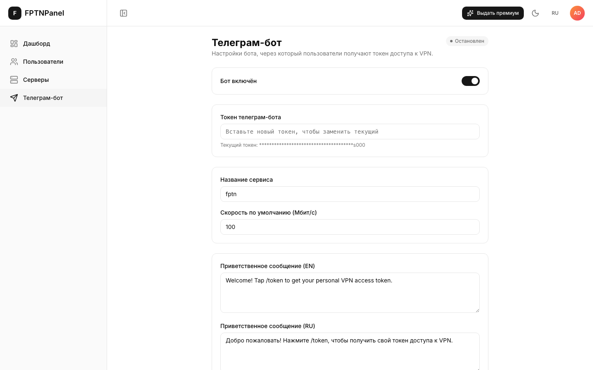

<div align="center">

<h1>FPTN Admin Panel</h1>
<h6>Простая веб-панель для управления вашим FPTN VPN-сервером</h6>

[\[English\]](README.md)
•
[\[Русский\]](README_RU.md)

[](https://github.com/fptn-project/fptn-admin/actions)

</div>

---

## Что это такое?

Если у вас есть свой сервер [FPTN](https://github.com/batchar2/fptn), рано или
поздно понадобится способ смотреть, кто им пользуется, добавлять и удалять
VPN-серверы, и управлять Telegram-ботом, который выдаёт людям токен доступа —
и всё это без правки конфигов вручную по SSH.

**FPTN Admin Panel** — это сайт, который открывается в браузере и делает всё
это за вас. Никакой командной строки и кода — только кнопки.

С его помощью можно:

- 👥 Смотреть всех пользователей VPN, искать/фильтровать их, блокировать и разблокировать, выдавать премиум
- 🖥️ Добавлять, редактировать и удалять VPN-серверы, к которым подключаются пользователи
- 🤖 Включать и выключать Telegram-бота, менять сообщение, которое он присылает новым пользователям
- 📊 Одним взглядом видеть, сколько людей пользуется сервисом
- 🌍 Переключаться между английским и русским в один клик
- 🌗 Светлая и тёмная тема

## Скриншоты

**Вход**


**Дашборд** — быстрый обзор: сколько всего пользователей


**Пользователи** — поиск, фильтры, блокировка/разблокировка и выдача премиума прямо из таблицы


**Серверы** — VPN-серверы, которые выдаются вашим пользователям


**Telegram-бот** — включение/выключение и приветственное сообщение на английском и русском


---

## Как установить

На компьютере или сервере нужна всего одна программа:
**[Docker](https://www.docker.com/)** (Docker Compose уже входит в его состав).

1. **Скачайте проект**

   ```bash
   git clone https://github.com/fptn-project/fptn-admin.git
   cd fptn-admin
   ```

2. **Создайте файл с настройками**

   ```bash
   cp .env.demo .env
   ```

   Менять в нём ничего не обязательно — значения по умолчанию отлично
   подходят, чтобы просто попробовать.

3. **Запустите всё одной командой**

   ```bash
   docker compose up --build
   ```

   Это соберёт и запустит две части: саму панель и небольшой сервер, который
   её обслуживает. В первый раз это займёт пару минут, дальше — намного
   быстрее.

4. **Откройте панель в браузере**

   Перейдите по адресу: **https://localhost:2663**

   Браузер предупредит, что соединение «не защищено» — это нормально. Панель
   сама создаёт себе сертификат при первом запуске, а браузеры по умолчанию
   не доверяют самоподписанным сертификатам. Нажмите «Дополнительно» →
   «Всё равно перейти» (формулировка зависит от браузера).

5. **Войдите**

   - Логин: `admin`
   - Пароль: `admin`

   Панель сразу попросит задать новый пароль — так и должно быть, это защита
   от того, чтобы кто-то остался работать с паролем по умолчанию.

Готово — вы внутри.

### Как остановить

```bash
docker compose down
```

Ничего не удаляется: пользователи, серверы и настройки остаются на диске.
Запустить снова можно в любой момент командой `docker compose up`.

---

<details>
<summary><strong>Для разработчиков</strong></summary>

### Структура проекта

```
fptn-admin/
  backend/     сервис на FastAPI (Poetry) — REST API + Telegram-бот
  frontend/    SPA админ-панели (React + TypeScript + Vite)
  docker-compose.yml
```

Подробности о стеке, локальном запуске без Docker, скриптах и тестах — в
[backend](backend) и [frontend](frontend).

### Как хранятся VPN-пользователи

Есть **один** источник правды: файл `users.list` fptn, общий с C++-сервером
fptn и Telegram-ботом этого проекта. По одной строке на пользователя:

```
<telegramId> <sha256_hex_password> <speed_MB> <is_premium(0|1)>
```

- пароли хранятся как SHA-256 hex (чтобы их принимал C++-сервер);
- `maxSpeed` соответствует колонке скорости (в МБ);
- `premiumAccess` соответствует `is_premium`;
- **`blocked` вычисляется, а не хранится:** пользователь заблокирован, когда
  `speed == 0`. Блокировка ставит скорость в 0 (сервер fptn после этого
  фактически останавливает туннель). Разблокировка восстанавливает скорость
  из `maxSpeed` запроса или из настройки `maxUserSpeedLimit`, если она не
  указана.

Админы панели (вход по JWT) не связаны с VPN-пользователями и хранятся
отдельно, в `admins.json` (пароли — bcrypt-хэши). Если хранилище пустое,
первый админ создаётся из `ADMIN_LOGIN` / `ADMIN_PASSWORD` (по умолчанию
`admin` / `admin`, как в Grafana). Пока используется пароль по умолчанию,
`login` возвращает `mustChangePassword: true` — фронтенд принудительно
показывает форму смены пароля, прежде чем пустить админа дальше.

### API

Все маршруты, кроме `/api/v1/auth/login`, требуют `Authorization: Bearer <token>`.

| Метод | Путь | Назначение |
|--------|------|---------|
| POST | `/api/v1/auth/login` | вход админа → JWT (+ `mustChangePassword`) |
| POST | `/api/v1/auth/change-password` | смена своего пароля (нужен текущий пароль) |
| POST | `/api/v1/auth/register` | создать пользователя панели (сервисного) |
| GET  | `/api/v1/users?page=&pageSize=&search=&filter=` | список (filter: all\|blocked\|premium) |
| GET  | `/api/v1/users/{username}` | один пользователь (404 `{"message":"User not found"}`) |
| PUT  | `/api/v1/users/{username}` | частичное обновление (username, maxSpeed, blocked, premiumAccess) |
| POST | `/api/v1/users` | создать VPN-пользователя → возвращает `token` |
| POST | `/api/v1/users/{username}/token` | перевыпустить токен — сбрасывает пароль на новый случайный |
| GET  | `/api/v1/servers` | список серверов (`regular` / `premium` / `censoredZone`) |
| POST | `/api/v1/servers` | добавить сервер (`kind`: regular\|premium\|censored) |
| PUT  | `/api/v1/servers/{kind}/{name}` | обновить сервер (host, fingerprint, port, ping, переименование) |
| DELETE | `/api/v1/servers/{kind}/{name}` | удалить сервер |
| GET  | `/api/v1/dashboard/highlights` | `{ totalUsers, premiumUsers, blockedUsers }` |
| GET  | `/api/v1/settings` | настройки бота/сервиса (telegram-токен замаскирован) |
| PUT  | `/api/v1/settings` | обновить настройки; смена `telegramToken`/`botEnabled` перезапускает бота |

Интерактивная документация (Swagger UI): `http://localhost:8000/docs`.

### Токен доступа VPN

`token` — это строка, которую вставляют в клиент fptn. Формируется точно так
же, как в telegram-боте: JSON `{version, service_name, username, password,
servers, censored_zone_servers}`, закодированный в base64 с префиксом `fptn:`
(`fptnb:` + brotli, если `ENABLE_BROTLI_COMPRESSION=true`). `servers` = premium
+ regular для премиум-пользователей, иначе только regular — берутся из общих
`servers.json` / `premium_servers.json` / `servers_censored_zone.json`.

В токен зашит **пароль в открытом виде** (хранится только его хэш), поэтому
получить токен можно только когда пароль известен: при создании
пользователя (возвращается в ответе) или через `.../token`, который
генерирует новый пароль и обновляет хэш — так же, как команда `/token` в
боте.

### Telegram-бот

`app/telegram_bot.py` запускает бота прямо в процессе бэкенда, отдельным
фоновым потоком — без отдельного контейнера. `/api/v1/settings`
(`telegramToken`, `botEnabled`) запускает и останавливает его; `/start` и
`/token` обращаются к тем же `vpn_store`/`server_store`, что и REST API,
поэтому бот и панель пишут в `users.list` через одну и ту же блокировку
файла.

Все поля — `telegramToken`, `botEnabled`, `maxUserSpeedLimit`, `serviceName`
и приветственные сообщения — хранятся в `bot_settings.json` (внутри
`FPTN_CONFIGS_FOLDER`) и редактируются со страницы настроек. Соответствующие
переменные окружения (`TELEGRAM_TOKEN`, `BOT_ENABLED`, ...) — это только
начальное значение при первом запуске, как и `ADMIN_LOGIN`/`ADMIN_PASSWORD`:
используются один раз, пока файла ещё нет; как только он появляется,
источником истины становится файл, а переменные окружения игнорируются.

### HTTPS

SPA отдаётся по HTTPS с самоподписанным сертификатом, который создаётся при
первом запуске и хранится в `certs/fullchain.pem` / `certs/privkey.pem`
внутри `FPTN_CONFIGS_FOLDER` — отсюда и предупреждение браузера. Для
настоящего продакшена поставьте перед панелью свой сертификат (обратный
прокси, Let's Encrypt, ...). Обычный `http://localhost:8080` просто
перенаправляет на HTTPS-порт, потому что браузеры по умолчанию открывают
`http://`, если ввести просто `host:port`. nginx также проксирует `/api/` на
бэкенд, так что SPA всегда обращается только к своему собственному origin.

### Запустить только бэкенд

```bash
docker compose up --build fptn-admin-backend
```

### Локальная разработка (без Docker)

```bash
cd backend
poetry install
poetry run uvicorn app.main:app --reload
```

Про запуск SPA локально — в [frontend/README.md](frontend/README.md).

### CI

`.github/workflows/ci.yml` на каждый push/PR прогоняет lint, тайпчек, тесты и
сборку и для фронтенда (npm), и для бэкенда (poetry). Смотрите
[вкладку Actions](https://github.com/fptn-project/fptn-admin/actions).

</details>
