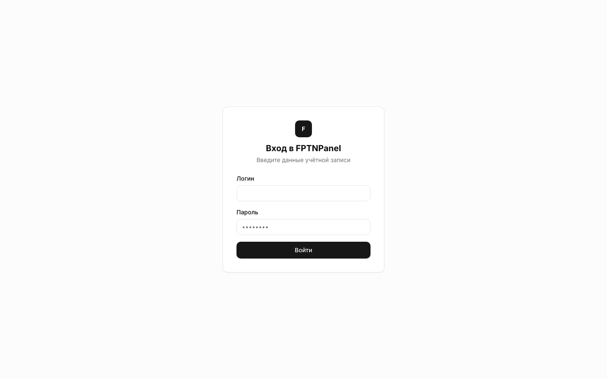
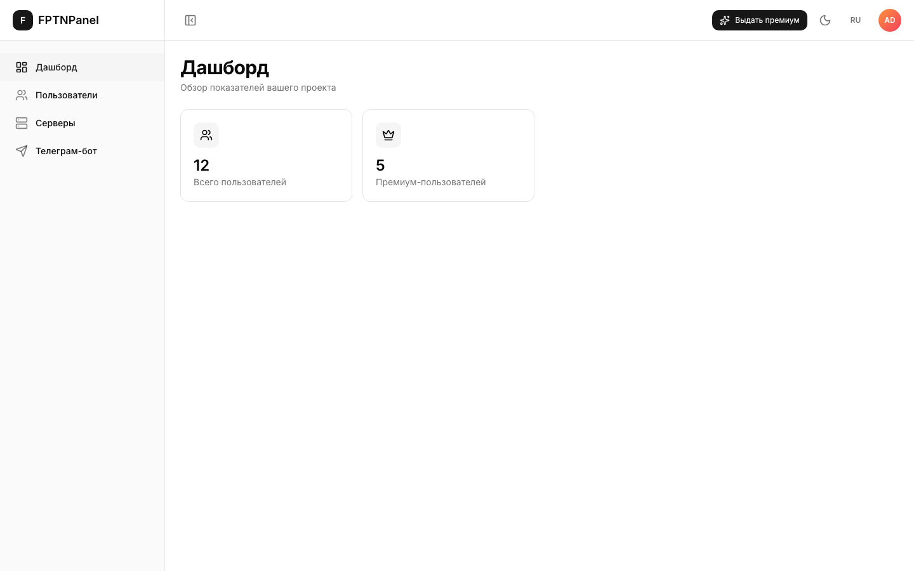
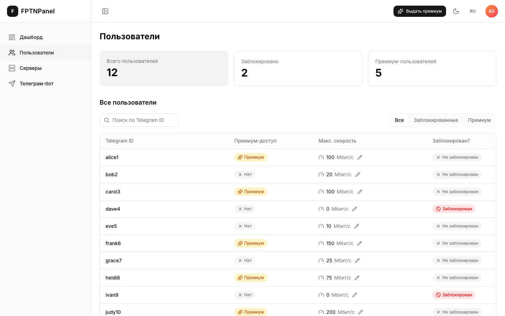
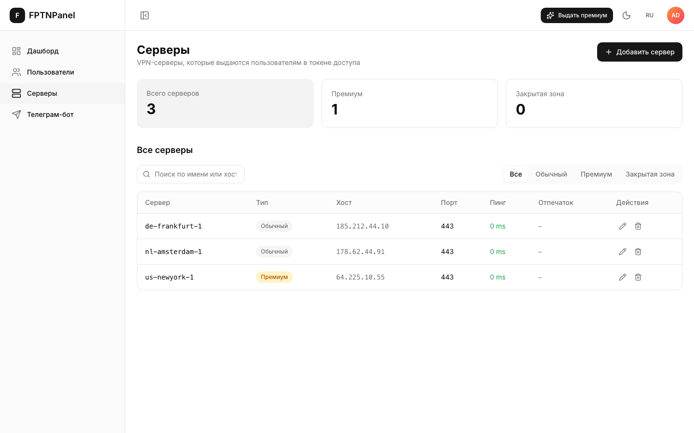
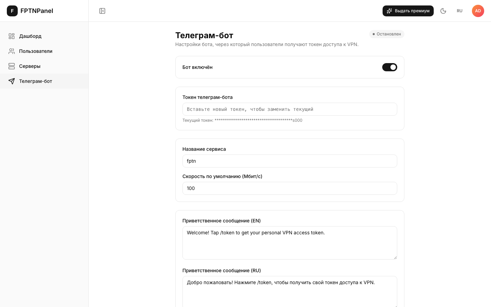

<div align="center">

<h1>FPTN Admin Panel</h1>
<h6>Простая веб-панель для управления вашим FPTN VPN-сервером</h6>

[\[English\]](README.md)
•
[\[Русский\]](README_RU.md)

[](https://github.com/fptn-project/fptn-admin/actions)

</div>

---

## Что это такое?

**FPTN Admin Panel** — веб-панель для управления VPN-сервером
[FPTN](https://github.com/batchar2/fptn) прямо из браузера: пользователи,
серверы и Telegram-бот без правки конфигов по SSH.

Возможности:

- 👥 **Пользователи** — добавление пользователей и выдача/перевыпуск токена
  доступа, поиск и фильтры, блокировка, премиум-доступ
- 🖥️ **Серверы** — добавление, редактирование и удаление VPN-серверов
- 🤖 **Telegram-бот** — включение/выключение и приветственное сообщение
- 📊 **Дашборд** — всего, премиум и заблокированных пользователей с одного взгляда
- 🌍 **Английский и русский**, светлая и тёмная темы

## Скриншоты

**Вход**


<br/>

**Дашборд** — быстрый обзор: сколько всего пользователей


<br/>

**Пользователи** — добавление пользователя, выдача/перевыпуск токена, поиск, фильтры, блокировка/разблокировка и выдача премиума прямо из таблицы


<br/>

**Серверы** — VPN-серверы, которые выдаются вашим пользователям


<br/>

**Telegram-бот** — включение/выключение и приветственное сообщение на английском и русском



---

## Как установить

`docker-compose.yml` поднимает весь стек — VPN-сервер FPTN, админ-панель
(бэкенд + фронтенд) и Telegram-бота — из готовых образов на Docker Hub. Нужен
**Linux**-сервер с **[Docker](https://docs.docker.com/engine/install/)** и
открытым портом **443/tcp**.

1. **Скачайте проект**

   ```bash
   git clone https://github.com/fptn-project/fptn-admin.git && cd fptn-admin
   ```

2. **Создайте `.env`**

   ```bash
   cp .env.demo .env
   ```

   Значения по умолчанию работают сразу; все параметры описаны в `.env.demo`.

3. **Создайте сертификат VPN-сервера**

   ```bash
   docker compose run --rm fptn-server sh -c "cd /etc/fptn && openssl genrsa -out server.key 2048"
   docker compose run --rm fptn-server sh -c "cd /etc/fptn && openssl req -new -x509 -key server.key -out server.crt -days 365 -subj '/CN=fptn'"
   ```

   Выведите его отпечаток — его вы укажете в панели на шаге 6:

   ```bash
   docker compose run --rm fptn-server sh -c "openssl x509 -noout -fingerprint -md5 -in /etc/fptn/server.crt | cut -d'=' -f2 | tr -d ':' | tr 'A-F' 'a-f' | xargs -I {} echo 'MD5 Fingerprint: {}'"
   ```

4. **Запустите**

   ```bash
   docker compose up -d
   ```

   Проверьте статус: `docker compose ps`.

5. **Откройте панель и войдите**

   Перейдите на **https://&lt;IP-сервера&gt;:2663**, примите предупреждение о
   самоподписанном сертификате и войдите с `admin` / `admin`. Панель сразу
   попросит задать новый пароль.

6. **Добавьте этот сервер, затем пользователей**

   В панели: **Серверы → Добавить сервер** (host, порт `443` и отпечаток из
   шага 3), затем **Пользователи → Добавить пользователя** — токен подключения
   (`fptn:…`) показывается при создании; вставьте его в клиент FPTN.

   Пользователь потерял токен или нужно его обновить? Нажмите **Выпустить
   токен** напротив него в таблице пользователей — новый токен выпускается
   сразу же, а старый перестаёт работать в тот же момент.

7. **Включите Telegram-бота** *(необязательно)*

   В панели: **Настройки** — вставьте токен бота и включите его. Бот работает
   внутри бэкенда, отдельный контейнер и перезапуск не нужны.

## Настройка

Все параметры задаются в `.env` (копия `.env.demo`, где каждый параметр описан
прямо в комментариях). Значения по умолчанию работают сразу.

**VPN-сервер FPTN**

| Переменная | По умолчанию | Назначение |
|---|---|---|
| `SERVER_EXTERNAL_IPS` | — | Публичные IPv4/IPv6 сервера через запятую (необязательно). |
| `FPTN_PORT` | `443` | Публичный TCP-порт для клиентов (выглядит как HTTPS). |
| `ENABLE_DETECT_PROBING` | `true` | Детект не-FPTN клиентов / зондирования на TLS-хендшейке. |
| `ALLOWED_SNI_LIST` | см. `.env.demo` | Домены-прикрытия, куда проксируется чужой трафик. |
| `ENABLE_ADS_FILTER`, `ADS_BLOCKLIST_URLS` | `true` | Блокировка рекламы/трекеров по SNI. |
| `ENABLE_DOMAIN_BLACKLIST_FILTER`, `DOMAIN_BLACKLIST_URLS` | `true` | Блокировка доменов по SNI + их IP. |
| `ENABLE_TORRENT_FILTER` | `true` | Блокировка BitTorrent. |
| `ENABLE_SPAM_FILTER` | `true` | Блокировка почты/telnet/SMB/amplification-портов. |
| `MAX_ACTIVE_SESSIONS_PER_USER` | `3` | Макс. одновременных сессий на пользователя. |
| `MTU_SIZE` | `1400` | Макс. размер IP-пакета. |
| `USING_DNS_SERVER`, `DNS_*` | `unbound` | DNS-резолвер для клиентов. |
| `USE_REMOTE_SERVER_AUTH`, `REMOTE_SERVER_AUTH_*` | `false` | Режим кластера: авторизация через мастер-сервер. |
| `PROMETHEUS_SECRET_ACCESS_KEY` | — | Ключ для чтения метрик Prometheus. |

**Админ-панель**

| Переменная | По умолчанию | Назначение |
|---|---|---|
| `PANEL_PORT` | `2663` | Хост-порт веб-интерфейса (HTTPS). |

Остальные параметры панели (логин `admin`/`admin`, JWT TTL, CORS, brotli)
захардкожены в `docker-compose.yml`; общая папка конфигов — `./compose-data`.
Telegram-бот (токен, вкл/выкл, имя сервиса, лимит скорости, приветствия)
настраивается на странице **«Настройки»** в панели, а не через `.env`.

## Обновление и остановка

```bash
docker compose down                           # остановить (данные в ./compose-data сохраняются)
docker compose pull && docker compose up -d   # обновить до свежих образов
```

## Разработка (сборка из исходников)

`docker-compose.dev.yml` поднимает тот же стек, но панель (бэкенд + фронтенд)
собирается из исходников, а не тянется образом:

```bash
cp .env.demo .env
docker compose -f docker-compose.dev.yml up --build
```

Откройте **https://localhost:2663** и войдите с `admin` / `admin`. Чтобы поднять
только панель (без VPN-сервера), укажите сервисы:
`docker compose -f docker-compose.dev.yml up --build fptn-admin-backend fptn-admin-frontend`.

---

<details>
<summary><strong>Для разработчиков</strong></summary>

### Структура проекта

```
fptn-admin/
  backend/                сервис на FastAPI (Poetry) — REST API + Telegram-бот
  frontend/               SPA админ-панели (React + TypeScript + Vite)
  docker-compose.yml      весь стек из готовых образов
  docker-compose.dev.yml  тот же стек, панель из исходников
```

Подробности о стеке, локальном запуске без Docker, скриптах и тестах — в
[backend](backend) и [frontend](frontend).

### Как хранятся VPN-пользователи

Есть **один** источник правды: файл `users.list` fptn, общий с C++-сервером
fptn и Telegram-ботом этого проекта. По одной строке на пользователя:

```
<telegramId> <sha256_hex_password> <speed_MB> <is_premium(0|1)>
```

- пароли хранятся как SHA-256 hex (чтобы их принимал C++-сервер);
- `maxSpeed` соответствует колонке скорости (в МБ);
- `premiumAccess` соответствует `is_premium`;
- **`blocked` вычисляется, а не хранится:** пользователь заблокирован, когда
  `speed == 0`. Блокировка ставит скорость в 0 (сервер fptn после этого
  фактически останавливает туннель). Разблокировка восстанавливает скорость
  из `maxSpeed` запроса или из настройки `maxUserSpeedLimit`, если она не
  указана.

Админы панели (вход по JWT) не связаны с VPN-пользователями и хранятся
отдельно, в `admins.json` (пароли — bcrypt-хэши). Если хранилище пустое,
первый админ создаётся из `ADMIN_LOGIN` / `ADMIN_PASSWORD` (по умолчанию
`admin` / `admin`, как в Grafana). Пока используется пароль по умолчанию,
`login` возвращает `mustChangePassword: true` — фронтенд принудительно
показывает форму смены пароля, прежде чем пустить админа дальше.

### API

Все маршруты, кроме `/api/v1/auth/login`, требуют `Authorization: Bearer <token>`.

| Метод | Путь | Назначение |
|--------|------|---------|
| POST | `/api/v1/auth/login` | вход админа → JWT (+ `mustChangePassword`) |
| POST | `/api/v1/auth/change-password` | смена своего пароля (нужен текущий пароль) |
| POST | `/api/v1/auth/register` | создать пользователя панели (сервисного) |
| GET  | `/api/v1/users?page=&pageSize=&search=&filter=` | список (filter: all\|blocked\|premium) |
| GET  | `/api/v1/users/{username}` | один пользователь (404 `{"message":"User not found"}`) |
| PUT  | `/api/v1/users/{username}` | частичное обновление (username, maxSpeed, blocked, premiumAccess) |
| POST | `/api/v1/users` | создать VPN-пользователя → возвращает `token` |
| POST | `/api/v1/users/{username}/token` | перевыпустить токен — сбрасывает пароль на новый случайный |
| GET  | `/api/v1/servers` | список серверов (`regular` / `premium` / `censoredZone`) |
| POST | `/api/v1/servers` | добавить сервер (`kind`: regular\|premium\|censored) |
| PUT  | `/api/v1/servers/{kind}/{name}` | обновить сервер (host, fingerprint, port, ping, переименование) |
| DELETE | `/api/v1/servers/{kind}/{name}` | удалить сервер |
| GET  | `/api/v1/dashboard/highlights` | `{ totalUsers, premiumUsers, blockedUsers }` |
| GET  | `/api/v1/settings` | настройки бота/сервиса (telegram-токен замаскирован) |
| PUT  | `/api/v1/settings` | обновить настройки; смена `telegramToken`/`botEnabled` перезапускает бота |

Интерактивная документация (Swagger UI): `http://localhost:8000/docs`.

### Токен доступа VPN

`token` — это строка, которую вставляют в клиент fptn. Формируется точно так
же, как в telegram-боте: JSON `{version, service_name, username, password,
servers, censored_zone_servers}`, закодированный в base64 с префиксом `fptn:`
(`fptnb:` + brotli, если `ENABLE_BROTLI_COMPRESSION=true`). `servers` = premium
+ regular для премиум-пользователей, иначе только regular — берутся из общих
`servers.json` / `premium_servers.json` / `servers_censored_zone.json`.

В токен зашит **пароль в открытом виде** (хранится только его хэш), поэтому
получить токен можно только когда пароль известен: при создании
пользователя (возвращается в ответе) или через `.../token`, который
генерирует новый пароль и обновляет хэш — так же, как команда `/token` в
боте.

### Telegram-бот

Бот работает внутри бэкенда — отдельный контейнер не нужен. Как включить:

1. Создайте бота у [@BotFather](https://t.me/BotFather) и скопируйте токен.
2. В панели откройте **Настройки**, вставьте токен, включите бота и сохраните —
   бот стартует сразу, перезапуск не нужен.
3. Там же задаются имя сервиса, лимит скорости по умолчанию и приветственные
   сообщения (EN/RU).

После этого пользователи пишут боту `/start` и `/token` — он создаёт их в том
же `users.list`, что и панель, и присылает токен подключения.

### HTTPS

SPA отдаётся по HTTPS с самоподписанным сертификатом, который создаётся при
первом запуске и хранится в `certs/fullchain.pem` / `certs/privkey.pem` в
каталоге конфигов `/etc/fptn` — отсюда и предупреждение браузера. Для
настоящего продакшена поставьте перед панелью свой сертификат (обратный
прокси, Let's Encrypt, ...). nginx также проксирует `/api/` на бэкенд, так что
SPA всегда обращается только к своему собственному origin.

### Запустить только бэкенд

```bash
docker compose -f docker-compose.dev.yml up --build fptn-admin-backend
```

### Локальная разработка (без Docker)

```bash
cd backend
poetry install
poetry run uvicorn app.main:app --reload
```

Про запуск SPA локально — в [frontend/README.md](frontend/README.md).

### CI

`.github/workflows/ci.yml` на каждый push/PR прогоняет lint, тайпчек, тесты и
сборку и для фронтенда (npm), и для бэкенда (poetry). Смотрите
[вкладку Actions](https://github.com/fptn-project/fptn-admin/actions).

</details>
